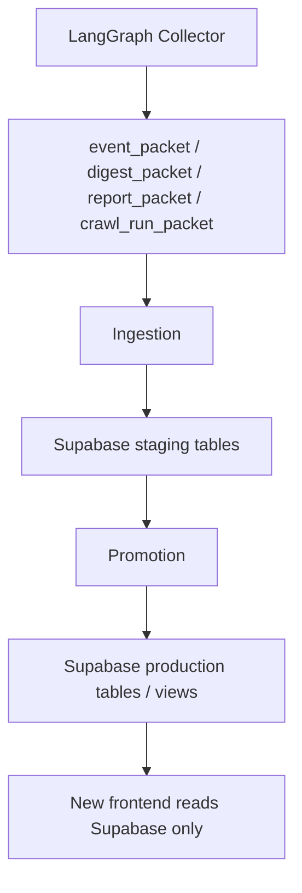

# System Data Flow

This project has a single official data path:

## Official direction

- LangGraph / Collector produces research packets.
- Ingestion writes those packets into Supabase staging tables.
- Promotion moves curated data from staging into production tables and views.
- Production tables and views are the only supported source for the future frontend.

## Explicit boundaries

- The frontend must not read Python code directly.
- The frontend must not read `output/` JSON files directly.
- The frontend must not call the Collector directly.
- The frontend must read only Supabase production views.
- `output/` JSON files are backend intermediate artifacts only.
- Supabase is the formal data center for the product.
- The old frontend can still be used as a visual reference.
- The new frontend should be regenerated from the Supabase schema and views.

## Current and future usage

### Current backend flow

1. Collector creates research packets.
2. Ingestion writes them to staging.
3. Promotion promotes them to production.
4. Production views power the frontend.

### Future frontend flow

The new frontend should query:

- `view_dashboard_events`
- `view_industry_cards`
- `view_stock_cards`
- `view_stock_detail_events`
- `view_macro_events`
- `view_institution_watch_events`
- `view_recent_reports`
- `view_unread_counts`

It should not reconstruct these structures from raw tables or output JSON.

## Related documentation

- [`frontend_integration/`](../frontend_integration/README.md) is the contract and query reference pack for the future Supabase-only frontend.
- [`supabase/frontend_query_contract.md`](../supabase/frontend_query_contract.md) defines the page-to-view mapping.
- [`supabase/frontend_query_views.sql`](../supabase/frontend_query_views.sql) defines the production views.
